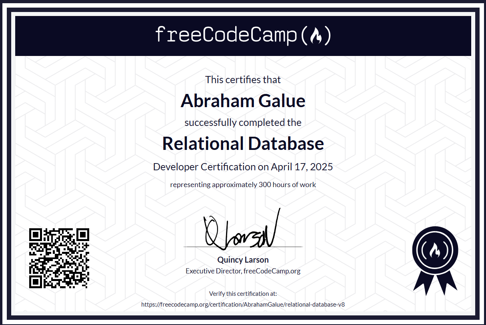

# 🔥 freeCodeCamp: Relational Database Certification

### Certificado de freeCodeCamp

> 🗝 Puedes verificar aquí la veracidad de mi [**certificado**](https://www.freecodecamp.org/certification/AbrahamGalue/relational-database-v8).

## 🚀 Descripción

Este es mi repositorio de proyectos con los cuales conseguí la **certificación de freeCodeCamp** en su curso de Bases de Datos Relacionales. Espero que te pueda ayudar.

## 🎭 Proyectos

Los **proyectos principales** para obtener el certificado y que se incluyen son:

- Celestial Bodies Database
- World Cup Database
- Salon Appointment Scheduler
- Periodic Table Database
- Number Guessing Game
